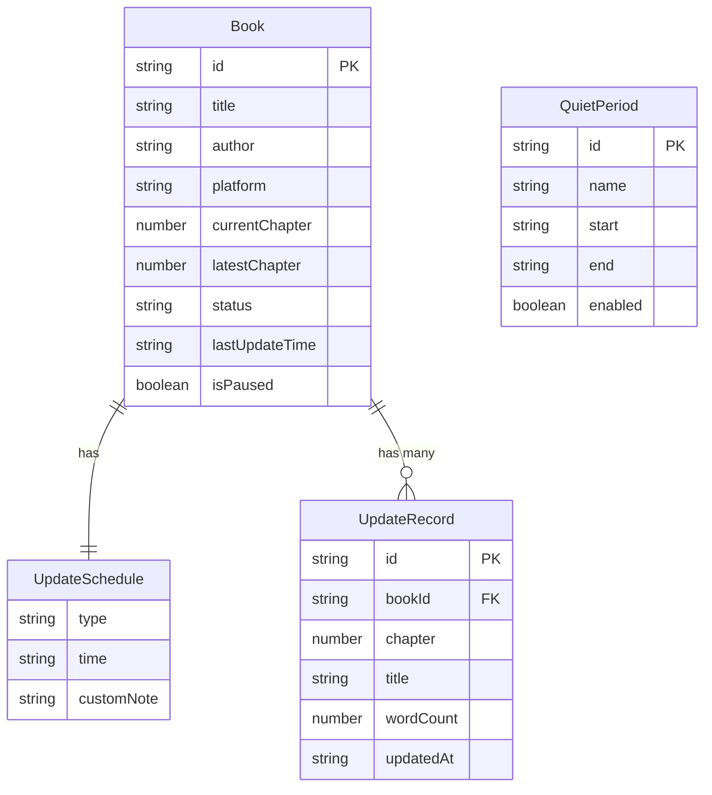

## 1. 架构设计

```mermaid
flowchart TB
    subgraph "前端层"
        "React App" --> "React Router"
        "React Router" --> "书架页"
        "React Router" --> "提醒详情页"
        "React Router" --> "设置页"
    end

    subgraph "状态管理层"
        "Zustand Store" --> "booksSlice"
        "Zustand Store" --> "remindersSlice"
        "Zustand Store" --> "settingsSlice"
    end

    subgraph "数据持久层"
        "localStorage" --> "booksData"
        "localStorage" --> "settingsData"
        "localStorage" --> "updateHistory"
    end

    subgraph "定时任务层"
        "UpdateChecker" --> "检查更新逻辑"
        "UpdateChecker" --> "安静模式过滤"
        "UpdateChecker" --> "合并提醒逻辑"
    end

    "书架页" --> "Zustand Store"
    "提醒详情页" --> "Zustand Store"
    "设置页" --> "Zustand Store"
    "Zustand Store" --> "localStorage"
    "UpdateChecker" --> "Zustand Store"
```

## 2. 技术说明

- 前端：React 18 + TypeScript + Tailwind CSS 3 + Vite
- 初始化工具：Vite (react-ts 模板)
- 后端：无（纯前端应用，所有数据本地存储）
- 数据库：localStorage（使用 zustand/middleware 的 persist 中间件）
- 状态管理：Zustand
- 路由：React Router v6
- 动画：framer-motion
- 图标：lucide-react
- 字体：Google Fonts (Noto Serif SC, Noto Sans SC, JetBrains Mono)

## 3. 路由定义

| 路由 | 用途 |
|------|------|
| / | 追更书架页，展示所有追更书籍列表 |
| /reminder/:bookId | 提醒详情页，展示单本小说的更新提醒和进度校准 |
| /settings | 设置页，安静模式、阅读时段、提醒偏好、数据管理 |

## 4. API 定义

无后端 API。所有数据操作通过 Zustand Store 在本地完成。

### 4.1 数据操作接口

```typescript
interface Book {
  id: string;
  title: string;
  author: string;
  platform: string;
  currentChapter: number;
  latestChapter: number;
  updateSchedule: UpdateSchedule;
  status: 'normal' | 'discontinued' | 'burst' | 'pending';
  lastUpdateTime: string;
  createdAt: string;
  isPaused: boolean;
}

interface UpdateSchedule {
  type: 'daily' | 'weekly' | 'custom';
  time: string;
  days?: number[];
  customNote?: string;
}

interface UpdateRecord {
  id: string;
  bookId: string;
  chapter: number;
  title: string;
  wordCount: number;
  updatedAt: string;
}

interface QuietPeriod {
  id: string;
  name: string;
  start: string;
  end: string;
  enabled: boolean;
}

interface ReadingTimeSlot {
  start: string;
  end: string;
}

interface AppSettings {
  quietPeriods: QuietPeriod[];
  readingTimeSlots: ReadingTimeSlot[];
  notificationsEnabled: boolean;
  soundEnabled: boolean;
  vibrationEnabled: boolean;
}
```

## 5. 服务端架构图

不适用（纯前端应用）

## 6. 数据模型

### 6.1 数据模型定义



### 6.2 数据定义语言

使用 localStorage 存储，数据结构如下：

- `bookshelf-books`: Book[] — 所有追更书籍
- `bookshelf-updates`: Record<string, UpdateRecord[]> — 每本书的更新记录，key 为 bookId
- `bookshelf-settings`: AppSettings — 应用设置
